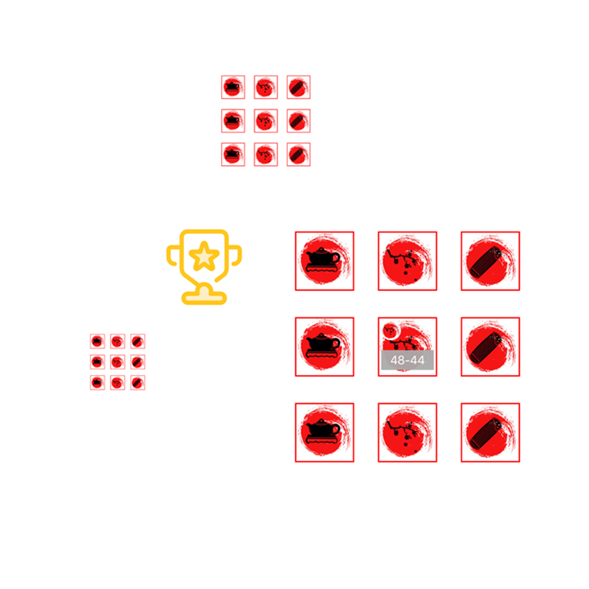

## 欢迎来到 巧算翻数字

这是一款非常有趣的益智类游戏，每一次会随机出现9张数字卡，分别分布在3种不同的图案中，每种图案分别代表不同难度的算术方程。当你翻开其中一张卡时，底部会出现3个答案，你需要选择正确的答案才能过关，否者游戏结束；答对一张时，得1分，你需要不断的答对连击，才能让分数累计，快来算算你的最高连击吧~

如果您遇到什么需要解答的问题，请发送您的问题到以下邮箱。

我们将第一时间为您解答。

### 邮箱地址: zhanghesongyuan7@126.com

谢谢！
